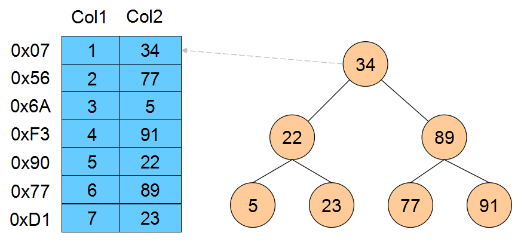

# 深入理解MySQL索引 #

----------

## 说在前面的话 ##

当我们使用数据库的时候，必然要讲到的一个话题就是“索引”。众所周知，索引优化是对查询性能优化最直接有效的手段，但是由于对索引的理解不深入，甚至可能忽略或者误解索引。那些糟糕的索引常常会导致性能问题，特别是当数据量非常大的时候，性能则会急剧下降。

## 1.索引基础 ##
### 索引是什么？ ###
索引是存储引擎用于快速找到记录的一种数据结构。提取这个定义的主干，索引的本质就是一种数据结构。更具体一点地理解，就是翻开一本《新华字典》的索引，小时候查字典的过程就类似利用索引查数据库的过程。“按部首查”，“按拼音查”其实就是根据一个字的部首或拼音属性在索引中快速得到这个字在字典中的页码。

### 为什么需要索引？ ###
我们知道，数据库的主要功能就是查询，我们都希望查询的速度尽可能的快，因此数据库系统的设计者会从查询算法的角度进行优化。最基本的查找算法是“顺序查找”，它会逐行查询，直到找到要查询的纪录行。这种算法在数据量很大时查询的性能是很糟糕的。还有更优秀的算法比如“二分查找”，“二叉树查找”等。但是这些算法都只能应用于特定的数据结构之上。二分查找要求被检索的数据有序，二叉树查找只能应用于二叉树结构。数据库中数据本身的组织方式不可能同时满足各种结构。所以，在数据本身之外，数据库系统还维护者满足特定查找算法的数据结构，这些数据结构以某种方式指向数据。这种数据结构，就是索引。

看一个例子：

上图展示了一种索引方式。左侧为数据表，包含两个例，Col1和Col2，一共有7条纪录。最左边的是数据行的物理地址（逻辑上相邻的物理行在磁盘上不一定是物理相邻的）。假设需求是根据Col2进行查找，在没有索引的情况下，查找的方式是从第一行开始逐行查找，复杂度是O(n)。为了加快查找，假设维护了右侧所示的二叉查找树（左子节点的值小于父节点，右子节点的值大于父节点），每个节点包含索引字段的键和指向对应数据纪录物理指针的地址，这样就可以利用二叉查找在O(log2n)的复杂度内获取到指定的数据纪录。

以上只是用二叉查找树来说明数据结构与索引的关系，以及索引是如何优化查找的。实际的数据库系统几乎没有用到二叉查找树，而是使用了B-Tree和B+Tree。

###宏观上理解索引###

从上面的分析可以看到，索引与表一样，里面都存放了用户数据，都需要占用磁盘空间。只不过，在索引里数据的组织形式与数据表里数据的组织形式不一样，通常索引占用的磁盘空间要比表小得多，主要作用是用来加快数据搜索和排序的速度，也可以用来保证数据的唯一性。

索引是一种可选的数据结构，可以为表创建或者不创建索引，一但创建就意味着对表进行DML（UPDATE、INSERT、DELETE）操作时，必须处理额外的工作（索引维护）以及存储方面的开销。所以创建索引时，需要考虑创建索引所带来的查询性能方面的提高，与引起的额外的开销相比，是否值得。

### B-Tree和B+Tree ###

事实上大部分数据库系统及文件系统都采用B-Tree或其变种B+Tree作为索引结构。在人们谈论数据库索引的时候，如果没有特别指明类型，那多半说的是B-Tree索引。

### B-Tree ###

## 2.MySQL索引实现 ##

## 3.高性能索引策略 ##
## 4.索引案例学习 ##
## 5.维护索引和表 ##

