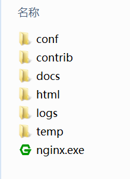
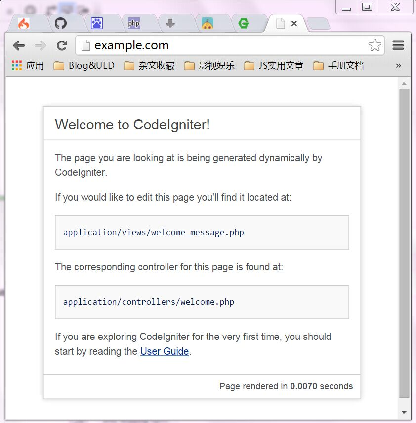

#CodeIgniter开发环境搭建
----------------------

- 安装PHP
- 安装MySQL
- 安装[nginx](2)
- 下载[CodeIgniter](1)开发包

PHP, MySQL安装很简单，自己在网上查找教程。
安装nginx，我的机器安装到C:\nmp\nginx目录，nginx的目录结构如下：

   

	- conf： nginx配置文件
	- html： 默认网站根目录
	- logs： 默认日志文件目录
	- temp： 临时静态缓存的目录
将下载后的CodeIgniter_2.2.0.zip开发包解压，重命名为C:\data\SVNRoot\src\example.com。example.com就是网站的根目录。  
配置nginx虚拟主机服务。新建一个C:\nmp\nginx\conf\vhosts\example.com.conf配置文件，并将主配置文件nginx.conf增加一行配置。

```
http {
	include C:/nmp/nginx/conf/vhosts/*.conf;
}
```
example.com.conf文件配置内容如下：
```
server {
	listen       80;
	server_name  example.com;
	root	     C:/data/SVNRoot/src/example.com;
	index        index.html index.htm index.php;
	
	location ~ \.(jpg|png|gif|js|css|swf|flv|ico)$ {
		 expires 12h;
	}

	location ~* ^/(doc|logs|application|system)/ {
		return 403;
	}

	location / {
		if (!-e $request_filename) {
			rewrite ^(.*)$ /index.php?$1 last ;
			break;
		}
	}

	location ~ .*\.(php|php5)?$
	{
		fastcgi_connect_timeout 300;
		fastcgi_send_timeout 300;
		fastcgi_read_timeout 300;
		fastcgi_pass   127.0.0.1:9000;
		fastcgi_index  index.php;
		fastcgi_param  SCRIPT_FILENAME $document_root$fastcgi_script_name;
		include        fastcgi_params;
	}
}
```

配置host文件：


```
127.0.0.1	example.com
```

在桌面新建一个fcgi_start.bat文件

```
@echo off

echo Stopping PHP FastCGI...
taskkill /F /IM php-cgi.exe > nul

echo Starting PHP FastCGI...
RunHiddenConsole c:/nmp/PHP/php-cgi.exe -b 127.0.0.1:9000 -c c:/nmp/PHP/php.ini
```

在桌面新建一个start_nginx.bat

```
@echo off

echo Stopping nginx...
taskkill /F /IM nginx.exe > nul

echo Starting nginx...
c:/nmp/nginx/nginx.exe -p c:/nmp/nginx -c c:/nmp/nginx/conf/nginx.conf
```

运行这2个文件

在浏览器访问


[1]: https://codeload.github.com/bcit-ci/CodeIgniter/zip/2.2-stable
[2]: http://nginx.org/download/nginx-1.4.7.zip
