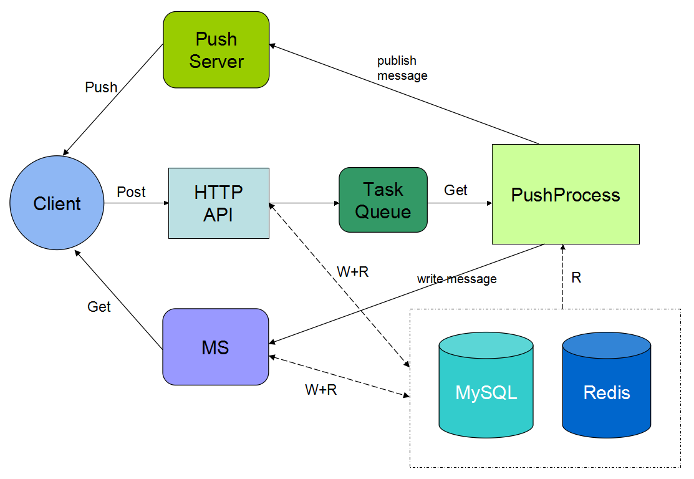

#Pingo Server Architecture

#Pingo服务器组件架构

------------------

#组件说明

- HTTP API  
http应用接口组件，为客户端提供查询，提交数据的服务。由PHP [codeigniter](http://codeigniter.org.cn) 框架实现。

- Task Queue  
推送任务队列组件，当用户发帖后，API组件写入一个推送任务到队列，PushProcess组件负责处理此任务。目前通过Redis List数组结构实现，后期可用[RabiitMQ](http://www.rabbitmq.com)。

- PushProcess  
推送逻辑组件，负责处理Task队列和一些其他推送逻辑，并生成约定格式的消息，双写到Push Server和MS组件

- MS  
消息拉取服务组件。客户端通过Get方式获取发送给自己的消息，PushProcess通过接口往此组件里写消息

- Push Server  
消息推送服务组件。负责往客户端推送消息，目前采用[mqtt](http://mqtt.org)协议，通过[mosquitto](http://mosquitto.org)实现。

- MySQL  
数据持久化存储DB

- Redis  
内存存储DB，同时提供持久化功能。Session，Cache也可以通过此实现

##备注
1. 所有组件理论上都应该布署在同一个私有网络里，通过开放端口向外网提供服务
2. 开发组件的时候，都应该考虑可“水平”扩展，提升系统性能就是水平扩展有瓶颈的组件
3. 不同组件在物理上可以交叉（多个组件共享一台机器）布署

